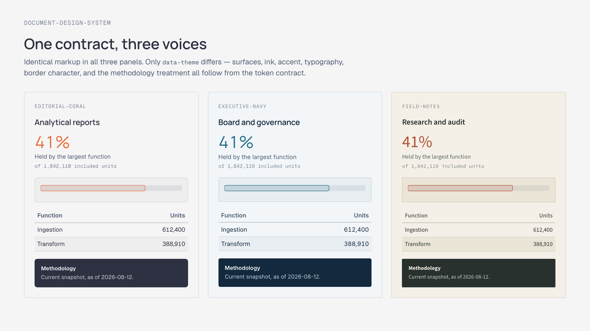
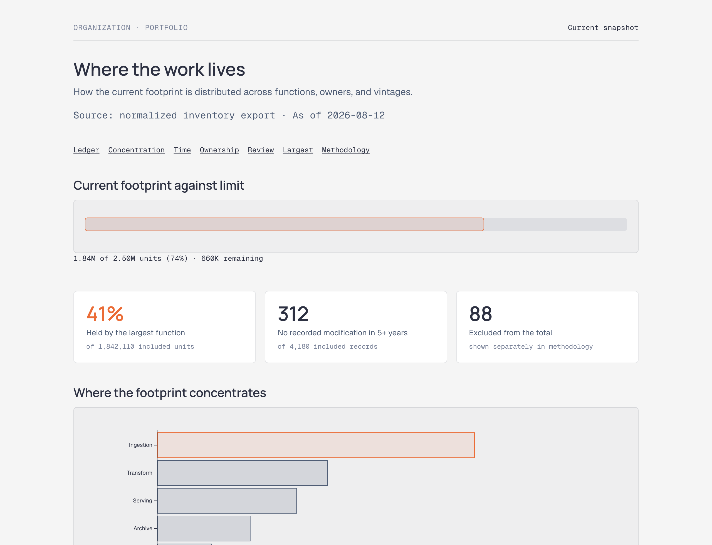
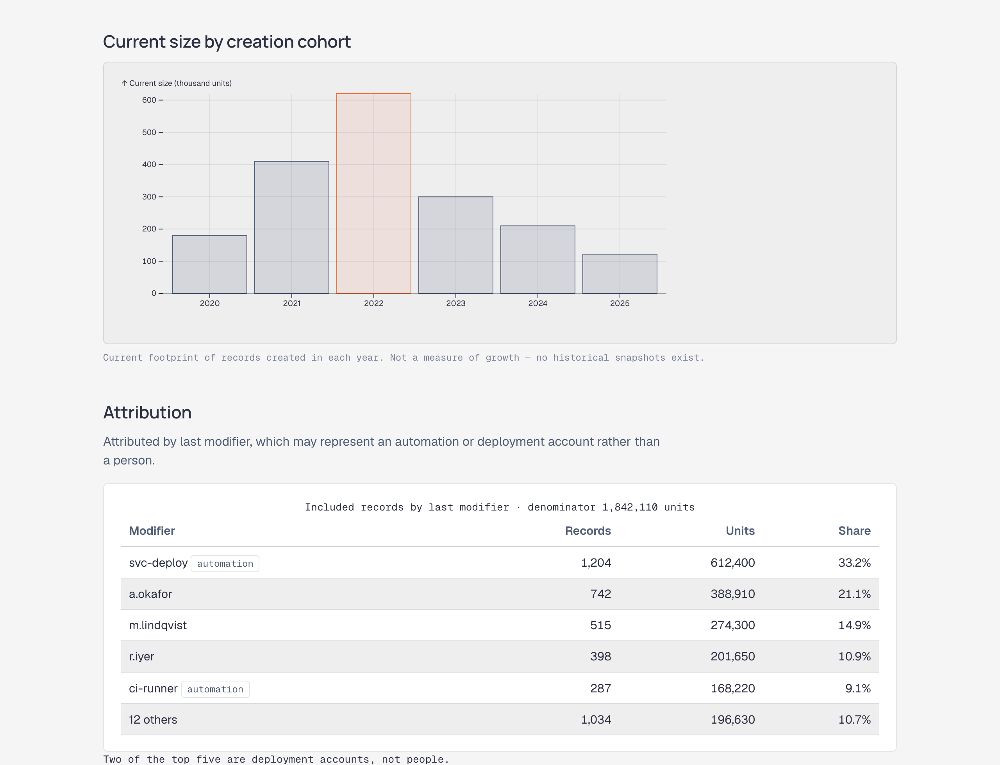
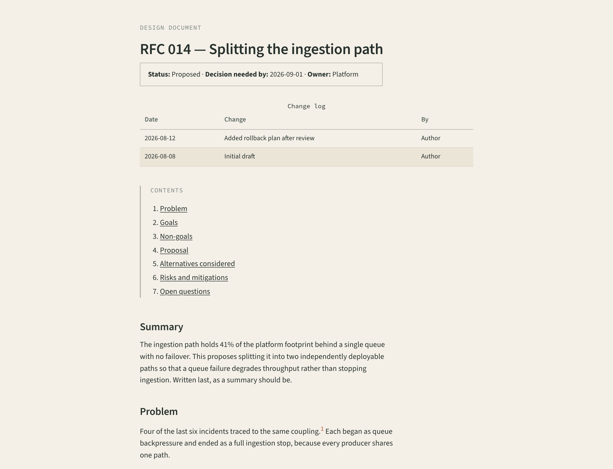
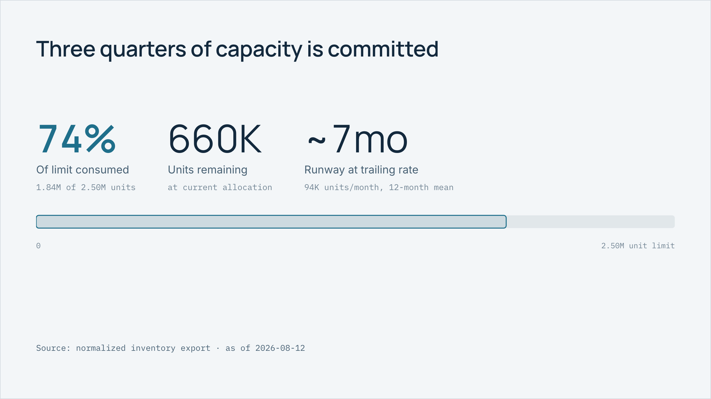
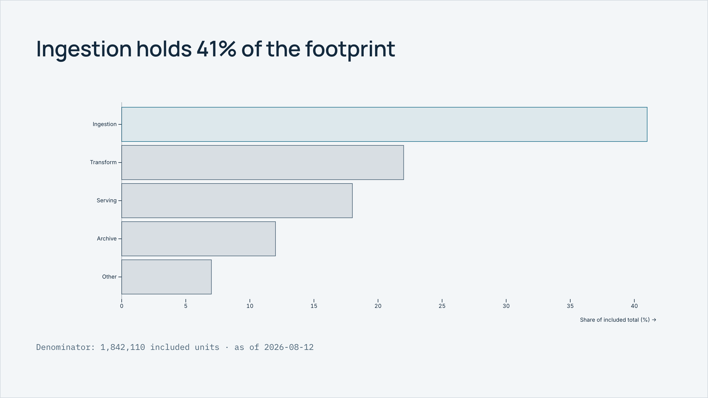

# document-design-system

**A design system for documents.** Five skills over one token contract — analytical reports, diagrams, charts, decks, and long-form specs — producing self-contained HTML that needs no JavaScript to read, no build step to open, and prints properly.

Most document tooling is welded to one output format or one client's brand. This is the discipline itself: what to measure, when a chart earns its place, how to structure an argument, and one shared set of semantic tokens underneath so a report, the diagram inside it, and the deck derived from it all look like one system.

```
/plugin marketplace add Avinava/document-design-system
/plugin install document-design-system@document-design-system
```

Or use it as a plain skills directory — copy `skills/` and `core/` into `.claude/skills/` or `.agents/skills/`.

---

## What it produces

Every image below is a committed example in [`examples/`](examples/), rebuilt from source by `python scripts/build_examples.py` and captured by `python scripts/shoot_examples.py`. Nothing is a mockup.

### Three themes, one contract

Identical markup in all three panels — only `data-theme` differs. Surfaces, ink, accent, typography, border character, and the methodology treatment all follow from the token contract.

[](examples/themes.html)

<sub>`editorial-coral` · `executive-navy` · `field-notes` — plus a documented `brand-template` slot · [source](examples/themes.html)</sub>

### Analytical report — evidence-led, reconciled, printable

Metric semantics, named denominators, a limit ledger, and a methodology block. The one that refuses to call a snapshot cohort "growth".

[](examples/inventory-report.html)

Further down the same document — cohort columns and an attribution table that flags which "owners" are actually deployment accounts:

[](examples/inventory-report.html)

<sub>`analytical-document-design` · theme `editorial-coral` · [source](examples/inventory-report.html) · prints to 3 A4 pages</sub>

### Long-form document — RFCs, design docs, ADRs, specs, postmortems

Measure held at 62–72 characters, explicit status banner, a change log for reviewers, and non-goals given their own box because it is the section most often skipped and most often needed.

[](examples/platform-rfc.html)

<sub>`longform-document-design` · theme `field-notes` · [source](examples/platform-rfc.html)</sub>

### Deck — 16:9 slides that export one-per-page to PDF

Type scales with the slide via container queries, so an authored slide and a projected slide agree. No JavaScript: a deck that renders blank without JS is not a deliverable.

| | |
|---|---|
| [](examples/capacity-deck.html) | [](examples/capacity-deck.html) |
| Up to three numbers, one accent between them, and the same measure drawn once underneath | Charts render at `full-width`, not the document size — a doc-inline chart on a slide shrinks its own labels to nothing |

[](examples/capacity-deck.html)

<sub>`presentation-design` · theme `executive-navy` · [source](examples/capacity-deck.html) · 7 slides → 7 PDF pages</sub>

### Figures — diagrams and charts on one token set

Six forms, one accent, all resolving against the document's tokens at view time.

[](examples/gallery.html)

<sub>`diagram-design` + `chart-design` · theme `editorial-coral` · [source](examples/gallery.html)</sub>

| Figure | Path | Why that path |
|---|---|---|
| Architecture | Hand-authored SVG | Position carries coupling — auto-layout would assert relationships nobody intended |
| Sequence | Mermaid → prerendered SVG | Order is dictated by the protocol, so auto-layout is honest |
| Ranked bars | Observable Plot → SVG | Sorted descending, zero baseline, one focal bar |
| Columns | Observable Plot → SVG | Chronological, never sorted by value |
| Line | Observable Plot → SVG | Straight segments; a spline invents readings between points |
| Limit ledger | Hand-authored SVG | A linear track beats a gauge — same value, stated precisely |

---

## The one idea

> **Everything renders to an SVG string at authoring time. The only thing still live in the shipped HTML is CSS custom properties.**

That single rule is what makes the rest cohere. Diagrams, charts, decks, and reports share one token set, retheme with zero JavaScript, survive print, and stay one file.

It also settles the perennial Mermaid question. Mermaid is a fine *notation* and a poor *output format* — its default rendering brings its own fonts, colors, and spacing, none of which know about the document they land in. So Mermaid is an input: prerendered through [`beautiful-mermaid`](https://github.com/lukilabs/beautiful-mermaid) into an SVG whose colors are `var(--…)` references.

Open any example and change one attribute:

```html
<html lang="en" data-theme="editorial-coral">   →   data-theme="executive-navy"
```

The page, the chart's focal bar, and the diagram's arrowheads all move together. Nothing re-renders and no JavaScript runs.

---

## The skills

| Skill | Owns | Does **not** own |
|---|---|---|
| **analytical-document-design** | Evidence models, control totals, metric semantics, cohort/time semantics, classification confidence, report architecture, methodology | Prose-first docs, slides, standalone charts |
| **diagram-design** | When a diagram earns its place, form routing, layout/edge/label rules, Mermaid→SVG prerender, hand-SVG for concept diagrams | Quantitative charts, UI mockups, editable `.drawio` |
| **chart-design** | Chart-type selection, axis honesty, encoding rules, palettes derived from tokens, grayscale survival | Narrative structure, dashboards-as-applications |
| **presentation-design** | 16:9 HTML slides, one-idea-per-slide, slide hierarchy, PDF export | Documents meant to be read rather than presented |
| **longform-document-design** | RFCs, design docs, ADRs, specs, postmortems, runbooks; prose hierarchy, cross-references, footnotes | Metric-led reports |

Each `SKILL.md` is a lean index — 117 to 181 lines — with the depth in `references/` loading only when relevant.

---

## Layout

```
core/            the shared design system — the single source of truth
  tokens.md        the semantic token contract
  themes/          editorial-coral · executive-navy · field-notes · brand-template
  base.css         component→token mapping (contains no color literals)
  print.css        print as a distinct output mode
  a11y.md          SVG labelling, contrast, grayscale, focus
skills/          the five skills, each SKILL.md + references/
scripts/         authoring-time tooling — never shipped to readers
templates/       document · longform · deck · gallery · themes · diagram
examples/        committed outputs, doubling as CI fixtures and the shots above
docs/screenshots/
```

## Themes

Three neutral themes plus a documented brand slot:

- `editorial-coral` — general analytical reports. The default.
- `executive-navy` — board, finance, governance.
- `field-notes` — research, audit, operational review.
- `brand-template` — copy it, fill every TODO, rename. There is a pre-ship checklist at the bottom of the file.

See the [theme comparison](#three-themes-one-contract) above, or open [`examples/themes.html`](examples/themes.html). Because themes select on `[data-theme]` rather than `:root`, and `core/base.css` re-derives its computed tokens at every theme boundary, a single page can carry several themes at once — that comparison is one document, not three.

A theme changes the visual voice, never the information architecture. It must not change metric definitions, category order, chart scales, included records, or conclusions.

## Tooling

All of it runs on the authoring machine. The delivered artifact is plain HTML and SVG.

```bash
npm install beautiful-mermaid @observablehq/plot jsdom     # renderers
pip install playwright && playwright install chromium      # PDF + screenshots

python3 scripts/build_examples.py       # rebuild every example from source
python3 scripts/shoot_examples.py       # refresh the screenshots above
python3 scripts/build_document.py templates/longform.html --theme field-notes --out rfc.html
python3 scripts/inline_fonts.py rfc.html --font "Geist:400:geist.woff2" --out offline.html
python3 scripts/validate_repository.py .
python3 -m unittest discover -s tests

node scripts/render_diagram.mjs in.mmd --id x --title "…" --desc "…" --out x.svg
node scripts/render_chart.mjs spec.json --out chart.svg
node scripts/export_pdf.mjs report.html --out report.pdf
node scripts/export_pdf.mjs deck.html --out deck.pdf --preset deck   # one slide per page
```

Both renderers wrap their upstream library rather than calling it directly, because raw output is not safe to inline into a designed document. Between them they strip an external Google Fonts request from inside the SVG, namespace generic element IDs that would otherwise collide across two figures on one page, remove fixed pixel dimensions that break print scaling, neutralize a hardcoded white background, and add the accessibility shell. Each is a verified upstream behavior, documented at the point it is handled.

## Verification

`.github/workflows/validate.yml` runs the tests, the repository linter, a template assembly check, and renders a diagram and a chart to assert their output contracts.

`scripts/validate_repository.py` reads the same files the skills read — `core/tokens.md` for the required tokens and `core/themes/*.css` for the palette — so the prose rules and the machine check cannot drift apart. It enforces the two-key frontmatter schema, name↔folder agreement, a mandatory `Do not use for …` clause in every description, complete token coverage in every theme, no color literals outside `core/themes/`, and no broken relative links.

Print is verified by exporting a PDF and looking at it, not by the presence of `@media print`. That check is what caught the report printing its title twice.

## Attribution

- **[cathrynlavery/diagram-design](https://github.com/cathrynlavery/diagram-design)** (MIT, © 2025 Cathryn Lavery) — the editorial standard in `diagram-design` is adapted from it: deletion as the highest-quality move, every node earning its place, one accent for the one or two things that matter, density around 4/10, hairlines over shadows, geometry on a 4px grid, and the position that Mermaid is an input to redraw rather than an output to embed. No code is used; the influence is on judgment, and it is credited in the skill itself.
- **[lukilabs/beautiful-mermaid](https://github.com/lukilabs/beautiful-mermaid)** (MIT, Craft Docs) — Mermaid parsing and layout to SVG strings. Its CSS-custom-property theming is what makes the zero-JavaScript retheme possible.
- **[Observable Plot](https://observablehq.com/plot/)** (ISC) — chart scales and layout.
- Anthropic's **skill-creator** conventions — progressive disclosure and description-writing patterns.

Full dependency licensing, including the MPL-2.0 note on the optional D2 escape hatch, is in [THIRD_PARTY_LICENSES.md](THIRD_PARTY_LICENSES.md).

## Contributing

1. Skills live at `skills/<name>/SKILL.md`, frontmatter limited to `name` and `description`.
2. The description states what it does, when to use it, and an explicit `Do not use for …` — these five skills sit close together and will otherwise compete for the same prompts.
3. Keep `SKILL.md` under 400 lines; depth goes in `references/`, and every reference file must be named from `SKILL.md` or it will never load.
4. Adding a token means adding it to every theme, including `brand-template.css`, and documenting it in `core/tokens.md`.
5. No color literals outside `core/themes/`.
6. `python3 scripts/validate_repository.py .` and `python3 -m unittest discover -s tests` must pass.

## License

MIT — see [LICENSE](LICENSE).
