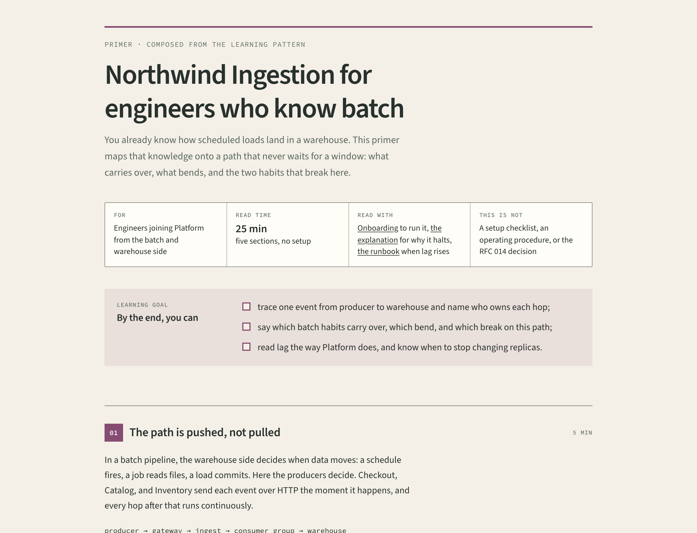

<p align="center">
  
</p>

<p align="center">
  <a href="LICENSE"></a>
  
  
  
  
  <a href="https://github.com/Avinava/document-design-system/actions/workflows/validate.yml"></a>
</p>

---

**Documents that get a reader to a decision.** Name the reader and the question they
bring: the question picks the document's shape (its **pattern** — where the answer sits,
what repeats, what the reader does last), the audience picks its voice (its **theme**), and
both sit on the same facts. Turn one and the other stays put.

Six skills share one set of design tokens: writing documents (thirty-four presets, and
composition when none fits), analytical reports, diagrams, charts, decks, and brand
themes. Writing lands as Markdown in your repository. Designed HTML is opt-in: no
JavaScript to read, no build step to open, and it prints.

The same story is on the site: **[avinava.github.io/document-design-system](https://avinava.github.io/document-design-system/)**.

---

## One engagement, four acts

Every example in this repository comes from one fictional engagement. Northwind
Ingestion runs every producer through one shared queue, and that queue keeps stopping all
of them at once; RFC 014 splits it in two. The story is ordered by the reader's job, not
the calendar: each document is the shape its reader's question needed. Every fact comes
from one ledger, [`examples/WORLD.md`](examples/WORLD.md).

**1. Understand — something broke; what is actually true?**

| For | The reader asks | Shape, and why it answers |
|---|---|---|
| Platform and Reliability | What happened, why, and what stops it recurring? | [Postmortem](examples/postmortem.html), `incident` — impact before narrative, then timeline, cause and owned actions |
| The platform review | Where does the platform footprint sit, measured? | [Analytical report](examples/inventory-report.html) — 41% is 1.84M of 2.50M units, the denominator named |
| Platform, before funding the build | What did we learn, and should we proceed? | [Discovery brief](examples/discovery.html), `decision` — ends on go, stop or reframe |

**2. Decide — should we do this, and what will it take?**

| For | The reader asks | Shape, and why it answers |
|---|---|---|
| The Platform director, with reviewers | Should we do this, and is the approach sound? | [Design doc](examples/design-doc.html), `decision` — the ask and its deadline first, then a change view |
| The Platform director | What will this take, and how confident are we? | [Basis of estimate](examples/estimate.html), `decision` — a waterfall to 24 engineer-weeks, CR-003 drawn but not counted |
| The Platform director, in the room | What are you asking me for, and by when? | [Deck](examples/capacity-deck.html) — the same decision presented, one claim per slide |

**3. Deliver — how do we get there without breaking producers?**

| For | The reader asks | Shape, and why it answers |
|---|---|---|
| Platform, Reliability and the producer teams | How will the agreed outcome be delivered and governed? | [Delivery plan](examples/delivery-plan.html), `plan` — five gates; the critical path is the one accent |
| The Platform director, Platform and Reliability | Where are we now, and what needs attention? | [Status report](examples/status-report.html), `brief` — Amber first, then the action each reader owns |
| Reliability, which approves the gate | Is this change ready for production? | [Readiness review](examples/readiness-review.html), `assurance` — the verdict beside its evidence |
| Platform, running the cutover | How do we move safely and back out? | [Migration plan](examples/migration-plan.html), `plan` — one partition at a time, the old queue kept recoverable |

**4. Run and hand on — who keeps it alive, and how does the next engineer learn it?**

| For | The reader asks | Shape, and why it answers |
|---|---|---|
| On-call, while the lag alert is firing | What do I do right now? | [Runbook](examples/runbook.html), `procedure` — safety before steps, with a deployment map |
| An engineer joining from batch work | Can I reuse what I know from batch loads here? | [Platform primer](examples/platform-primer.html), `learning`, composed — no preset fits, so the pattern's modules build it |

| | |
|---|---|
| [](examples/postmortem.html) | [](examples/inventory-report.html) |
| `incident` pattern — impact strip, timeline, owned actions | Analytical report — 41% of the footprint, denominators named |
| [](examples/design-doc.html) | [](examples/delivery-plan.html) |
| `decision` pattern — the ask, options, decision rail | `plan` pattern — milestone rail, workstreams, gates |

The deck is a presented ask, not a document with page breaks: fourteen slides, one idea
each, claim titles, one slide per PDF page.

| | |
|---|---|
| [](examples/capacity-deck.html) | [](examples/capacity-deck.html) |
| The title names the argument, not the meeting | Three options on the same criteria; the accent is the recommendation |

---

## Two dials: how it reads, how it sounds

A **pattern** fixes reading order. There are eleven, and every preset belongs to one:

| Pattern | Reading movement | Presets |
|---|---|---|
| `decision` | ask → choices → trade-offs → next move | `design-doc`, `discovery`, `proposal`, `project-charter`, `estimate`, `change-request` |
| `record` | status → decision → consequences | `adr` |
| `contract` | definitions → exact rules → specimens → compliance | `spec`, `api-contract`, `reference`, `requirements`, `statement-of-work`, `support-model` |
| `procedure` | safety → steps → verification → recovery | `handoff`, `how-to`, `runbook` |
| `learning` | context → practice → checkpoint → takeaway | `explanation`, `onboarding`, `tutorial` |
| `system` | map → boundaries → interfaces → states | `architecture`, `design-handoff` |
| `incident` | impact → timeline → cause → owned action | `postmortem` |
| `suite` | document map → ownership → freshness | `service-docs` |
| `plan` | baseline → workstreams → dependencies → gates | `delivery-plan`, `migration-plan`, `test-strategy` |
| `assurance` | verdict → evidence → findings → residual risk | `test-report`, `threat-model`, `readiness-review`, `risk-register` |
| `brief` | current state → material change → action → next update | `status-report`, `release-notes`, `workshop-summary`, `incident-update` |

A **theme** sets type, colour and density through tokens. Identical markup in every panel
below; only `data-theme` differs.

<picture>
  <source media="(prefers-color-scheme: dark)" srcset="docs/screenshots/themes-dark.png">
  
</picture>

<sub>This image follows your GitHub theme. [source](examples/themes-light.html)</sub>

| Theme | For | |
|---|---|---|
| `editorial-coral` | General analytical reports, portfolio reviews | light · default |
| `executive-navy` | Board, finance, governance | light |
| `field-notes` | Research, audit, operational review | light |
| `console-violet` | Engineering readouts, ops reviews, incident write-ups | **dark** |
| `horizon` | A client brand applied — what `brand-theme-design` produces | light |
| `brand-template` | Your own brand — copy, fill every TODO, rename | — |

The same proposal in three voices — one body, three themes; the facts and order do not move:

| | | |
|---|---|---|
| [](examples/proposal.html) | [](examples/proposal-coral.html) | [](examples/proposal-horizon.html) |
| `executive-navy` — board voice | `editorial-coral` — analytical voice | `horizon` — the client brand |

**Or wear the client's brand.** Point `brand-theme-design` at a brand guide PDF, a website,
a screenshot, or a few hex values. It extracts with provenance, maps to the semantic
roles, and audits every contrast pair — brand colours are chosen for logos and routinely
fail as body text. `horizon` is that process finished: the [exhibit](examples/brand.html),
the theme in `core/themes/horizon.css`, and the [document you send](examples/proposal-horizon.html).

```bash
python3 scripts/extract_site_theme.py https://example.com   # computed styles, not pixels
python3 scripts/audit_theme.py core/themes/horizon.css      # every pair, exact thresholds
```

`console-violet` is the dark theme. Its accent is violet rather than amber because amber
sat **6° from `--warning`**, and where status colours carry meaning an accent that close
makes every real warning ambiguous. A dark theme also restores a dark ink ramp for print,
or it prints white on white; a test fails any dark theme without it. Themes select on
`[data-theme]`, so one page can carry several — [`examples/themes-light.html`](examples/themes-light.html)
is one document.

---

## When no type fits, compose

Thirty-four presets cover the usual engagement documents. When a request falls between
them, start from the reader's question. It names the pattern, and the pattern names the
modules the page may use:

1. **Match a type or a familiar name.** HLD, LLD, TDD, PRD, API spec, PRR, RAID and other
   familiar names route to their canonical owner in
   [`type-index.md`](skills/writing-documents/references/type-index.md); a familiar name
   never becomes a second type.
2. **Otherwise pick the pattern by the reader's question** — the table at the top of
   `type-index.md`.
3. **Compose from that pattern's modules**, with the nearest preset's section discipline
   and theme. The [module registry](core/document-patterns.md#modules) lists every module
   and the patterns that may use it.

[](examples/platform-primer.html)

<sub>The [platform primer](examples/platform-primer.html): an engineer arriving from batch
work asks how ingestion maps onto what they know. No preset answers that, so it is composed
in the `learning` pattern from a scope strip, a learning goal, a crosswalk and section
takeaways; nearest preset `explanation`. Run it with `/document-design-system:compose`.</sub>

A shape composed three times becomes a preset. That is the only way the catalog grows.

The live [Patterns page](https://avinava.github.io/document-design-system/types.html)
starts from the reader's question; the [Modules page](https://avinava.github.io/document-design-system/modules.html)
shows a specimen of every module. Locally, open [`examples/index.html`](examples/index.html).

[](examples/index.html)

`/document-design-system:mulesoft` remains a compatibility profile of `service-docs`.

---

## Figures that stay true

Diagrams and charts are SVG whose colours are `var(--…)`, so they follow the document's
theme with nothing re-rendered. This image follows your GitHub theme, and both renderings
use the **same SVG files**:

<picture>
  <source media="(prefers-color-scheme: dark)" srcset="docs/screenshots/gallery-dark.png">
  
</picture>

<sub>`diagram-design` + `chart-design` · rendered in `editorial-coral` and `console-violet` · [source](examples/gallery-light.html)</sub>

| Figure | Reader's question | Path |
|---|---|---|
| Architecture | How is it arranged? | Hand-authored SVG — position carries coupling |
| Change view | What changes, and what stays the same? | Hand-authored SVG — before above after, a ledger names each change in words |
| Deployment map | Where does each part run? | Hand-authored SVG — cluster, namespace, replicas |
| Dependency graph | What blocks what, and which path sets the date? | Hand-authored SVG — the critical path is the one accent |
| Sequence | In what order do the calls happen? | Mermaid → prerendered SVG — order is dictated by the protocol |
| Ranked bars | Which is largest? | Plot → SVG — sorted, zero baseline, one focal bar |
| Columns | How did it change by period? | Plot → SVG — chronological, never sorted by value |
| Line | What is the trend? | Plot → SVG — straight segments; a spline invents readings |
| Waterfall bridge | How do the parts add up to the total? | Plot → SVG — the render fails if a total is not the sum of its steps |
| Limit ledger | How close are we to the limit? | Hand-authored SVG — a linear track beats a gauge |

The diagram skill documents fifteen forms. Mermaid and draw.io files are inputs:
`scripts/import_diagram.py` extracts their structure (nodes, edges, groups — no
coordinates) and the figure is redrawn on tokens. SVG is the output.

**The one idea.** Everything renders to an SVG string at authoring time. The only thing
still live in the shipped HTML is CSS custom properties. Open any example and change one
attribute:

```html
<html lang="en" data-theme="editorial-coral">   →   data-theme="executive-navy"
```

The page, the chart's focal bar, and the diagram's arrowheads move together. No
JavaScript runs.

---

## Checked, not eyeballed

Every row is a check that fails the build when it finds a problem.

| Check | What it guards |
|---|---|
| `scripts/validate_repository.py .` | Two-key skill frontmatter, `Do not use for …` clauses, a 14,000-byte `SKILL.md` cap; every type file's pattern and theme; the reader-question table and lifecycle stages against the catalog; the module registry against the stylesheet and the example bodies; full token coverage in every theme; no colour literals outside `core/themes/`; every version mention equal to the pins; licence rows equal to the imports; no broken relative links |
| `scripts/check_diagrams.py` | Eighteen rule IDs over every figure's coordinates (`--rules` lists them): accessibility shell, `var()`-only colour, structure classes, the 4px grid, node overlap, `viewBox` bounds, edge-label occlusion and gap, attachment fan, legend size, one emphasis family, callout limit |
| `scripts/check_render.py` | Every example in Chromium at 1280px, 390px and print width under every theme, and the site pages in light and dark: no page-level horizontal scroll, no zero-size figure, no SVG text outside its `viewBox`, no table spilling from a wrapper that cannot scroll |
| `scripts/audit_theme.py --all` | Contrast for every text pair, one accent, accent hue clear of the status colours, the dark-theme print rule |
| `scripts/build_site.py --check` | Every act has stops; every story stop's date read from its own source and its pattern and theme from the built page; every module and composed example linked; every back link landing on an anchor that exists; every image in `docs/screenshots/` shown somewhere and every one shown present; the release named on the site equal to `plugin.json` |
| `python3 -m unittest discover -s tests` | Markdown and HTML share titles and facts; good and bad diagram fixtures, hostile importer fixtures, a waterfall that must fail on a wrong total |

Print is verified by exporting a PDF and looking at it, not by the presence of
`@media print`. That check is what caught the report printing its title twice.

---

## The skills

Each row is a committed example, not a description of intent.

| Skill | Owns | Does **not** own | Example |
|---|---|---|---|
| **[analytical-document-design](skills/analytical-document-design/SKILL.md)** | Evidence models, control totals, metric semantics, cohort/time semantics, classification confidence, report architecture, methodology | Prose-first docs, slides, standalone charts | [inventory-report](examples/inventory-report.html) |
| **[diagram-design](skills/diagram-design/SKILL.md)** | When a diagram earns its place, fifteen forms, layout/edge/label rules, Mermaid→SVG prerender, draw.io and Mermaid structure import, geometry checked by `check_diagrams.py` | Quantitative charts, UI mockups, editable diagram files as output | [figure gallery](examples/gallery-light.html) |
| **[chart-design](skills/chart-design/SKILL.md)** | Chart-type selection, axis honesty, encoding rules, palettes derived from tokens, a waterfall that checks its totals, grayscale survival | Narrative structure, dashboards-as-applications | [estimate](examples/estimate.html) |
| **[presentation-design](skills/presentation-design/SKILL.md)** | 16:9 HTML slides; claim titles; one idea per slide; title, agenda, statement, divider, metric, chart, diagram, comparison, table, closing; PDF one slide per page | Documents meant to be read rather than presented; editable `.pptx` | [capacity-deck](examples/capacity-deck.html) |
| **[writing-documents](skills/writing-documents/SKILL.md)** | Thirty-four presets across eleven patterns, and composition from a pattern's modules when none fits; Markdown by default; designed HTML only when asked | Metric-led reports; casual edits to existing markdown; restyling into HTML unprompted | [Patterns page](examples/index.html) |
| **[brand-theme-design](skills/brand-theme-design/SKILL.md)** | Turning a brand into a theme — extraction from a guide, site, or screenshot; mapping to semantic roles; contrast auditing | Picking between themes that already ship; restyling one document | [themes](examples/themes-light.html) |

Each `SKILL.md` is a lean index with the depth in `references/`, loading only when relevant.

---

## Install

```
/plugin marketplace add Avinava/document-design-system
/plugin install document-design-system@document-design-system
```

Then `/plugin` to confirm it is installed. Ask for the document you need in plain words —
"write the cutover plan for RFC 014", "make a primer for engineers joining from batch" — or
use a command such as `/document-design-system:handoff` (or `adr`, `design-doc`, `compose`,
…). Writing lands as Markdown in the repository unless you asked for HTML.

The repetition on the second line is not a typo. `@` reads as "from": it names a *plugin*
and the *catalog* it came from, and this repository publishes its own catalog containing
this one plugin, so both halves are the same word. The catalog is named after the
repository deliberately — marketplace names are global per user, so two repositories
publishing catalogs under a shared name would silently replace one another and orphan the
plugins installed from the loser. A per-repository name is unique by construction.

<details>
<summary>Or install it as plain skills, without the plugin system</summary>

```bash
npx skills add Avinava/document-design-system                      # all six
npx skills add Avinava/document-design-system --skill chart-design # just one
```

Each skill is self-contained: it carries its own copy of the `core/` tokens, the
`scripts/` and the `templates/` it uses, so a skill works wherever it lands. Those copies
are generated from the repository-level `core/`, `scripts/` and `templates/` by
`python3 scripts/sync_skill_assets.py`; edit the originals and re-run it, never the copies.

Without the CLI, copy any `skills/<name>/` directory into `.claude/skills/` (or your
agent's skills directory). The slash commands ship only with the plugin.

</details>

---

## Built on

Readers need nothing installed: a delivered document is HTML and SVG. The authoring
toolchain runs only on the machine that writes it, pinned to exact versions in
`package.json` / `package-lock.json` and `requirements-authoring.txt`. Licences and
versions for every package are in [THIRD_PARTY_LICENSES.md](THIRD_PARTY_LICENSES.md).

- **[lukilabs/beautiful-mermaid](https://github.com/lukilabs/beautiful-mermaid)** (MIT, Craft Docs) — Mermaid parsing and layout to SVG strings. Its CSS-custom-property theming is what makes the zero-JavaScript retheme possible.
- **[Observable Plot](https://observablehq.com/plot/)** (ISC) with **jsdom** (MIT) — chart scales and layout, rendered server-side.
- **Playwright** (Apache-2.0) and **Pillow** (MIT-CMU) — PDF export, screenshots, brand extraction and the render check.
- **Design influence: [cathrynlavery/diagram-design](https://github.com/cathrynlavery/diagram-design)** (MIT, © 2025 Cathryn Lavery) — the editorial standard in `diagram-design` is adapted from it: deletion as the highest-quality move, every node earning its place, one accent for the one or two things that matter, density around 4/10, hairlines over shadows, geometry on a 4px grid, label geometry verified rather than eyeballed, and diagram files as structure to redraw rather than output to embed. No code is used; the influence is on judgment, and it is credited in the skill itself.
- Anthropic's **skill-creator** conventions — progressive disclosure and description-writing patterns.

### Layout

```
core/            the shared design system — the single source of truth
  tokens.md        the semantic token contract
  themes/          editorial-coral · executive-navy · field-notes · console-violet · horizon · brand-template
  base.css         component→token mapping (contains no color literals)
  document-patterns.{md,css}  the eleven patterns and the module registry
  print.css        print as a distinct output mode
  a11y.md          SVG labelling, contrast, grayscale, focus
skills/          the six skills, each SKILL.md + references/
commands/        /document-design-system:<slug> for each preset, plus compose
scripts/         authoring-time tooling — never shipped to readers
templates/       document · longform · types/<slug> · composed/<slug> · deck · site · docs-gallery · modules · gallery · themes · diagram
examples/        committed outputs, doubling as CI fixtures and the shots above
assets/          banner.svg — literal colors, because  is an isolated document
docs/screenshots/
tests/           standard library only, so CI needs no install step for them
```

## Tooling

All of it runs on the authoring machine. Node 22.22.2 or newer is required (`.npmrc` sets
`engine-strict`, so an older Node fails at install); the validator, tests and document
build need only the Python standard library.

```bash
nvm use && npm ci                                           # renderers + PDF export, pinned in package-lock.json
uv venv && uv pip install -r requirements-authoring.txt     # screenshots, render check, brand extraction, pinned
uv run playwright install chromium

python3 scripts/build_examples.py          # reports, decks, figures, every preset and composed example, Patterns page
python3 scripts/sync_skill_assets.py       # refresh each skill's generated copies of core/, scripts/, templates/
python3 scripts/build_site.py              # GitHub Pages site in site/ (gitignored)
uv run python3 scripts/shoot_examples.py   # refresh referenced screenshots; noise-only captures keep the committed image
python3 scripts/inline_fonts.py rfc.html --font "Geist:400:geist.woff2" --out offline.html

node scripts/render_diagram.mjs in.mmd --id x --title "…" --desc "…" --out x.svg
node scripts/render_chart.mjs spec.json --out chart.svg
python3 scripts/import_diagram.py old.drawio      # draw.io or Mermaid flowchart → structure as JSON
node scripts/export_pdf.mjs report.html --out report.pdf
node scripts/export_pdf.mjs deck.html --out deck.pdf --preset deck   # one slide per page
```

Both renderers wrap their upstream library rather than calling it directly, because raw
output is not safe to inline into a designed document. Between them they strip an external
font request from inside the SVG, namespace generic element IDs that would otherwise collide
across two figures on one page, remove fixed pixel dimensions that break print scaling,
neutralize a hardcoded white background, and add the accessibility shell.

## Verification

```bash
python3 scripts/sync_skill_assets.py --check
python3 -m unittest discover -s tests
python3 scripts/validate_repository.py .
python3 scripts/check_diagrams.py
uv run python3 scripts/check_render.py
python3 scripts/audit_theme.py --all --quiet
python3 scripts/build_site.py --check
```

`.github/workflows/validate.yml` runs all of these, renders a diagram, a chart and a
waterfall to assert their output contracts (a waterfall whose total does not add up must
fail), rebuilds every example and fails if the committed output is stale, and
render-checks the built site pages in light and dark. Pushes to `main` deploy the site
via [`.github/workflows/pages.yml`](.github/workflows/pages.yml).

## Contributing

1. Skills live at `skills/<name>/SKILL.md`, frontmatter limited to `name` and `description`.
2. The description states what it does, when to use it, and an explicit `Do not use for …` — these six skills sit close together and will otherwise compete for the same prompts.
3. Keep `SKILL.md` within 14,000 bytes and its description within 1,024 characters (the validator fails either); depth goes in `references/`, and every reference file must be named from `SKILL.md` or it will never load.
4. A type is edited in its `type-<slug>.md` YAML block only; `scripts/catalog.py` derives everything else. A new type comes from promotion: a composed shape seen three times.
5. Adding a token means adding it to every theme, including `brand-template.css`, and documenting it in `core/tokens.md`.
6. No color literals outside `core/themes/`.
7. The checks under [Verification](#verification) must pass.

## License

MIT — see [LICENSE](LICENSE).
